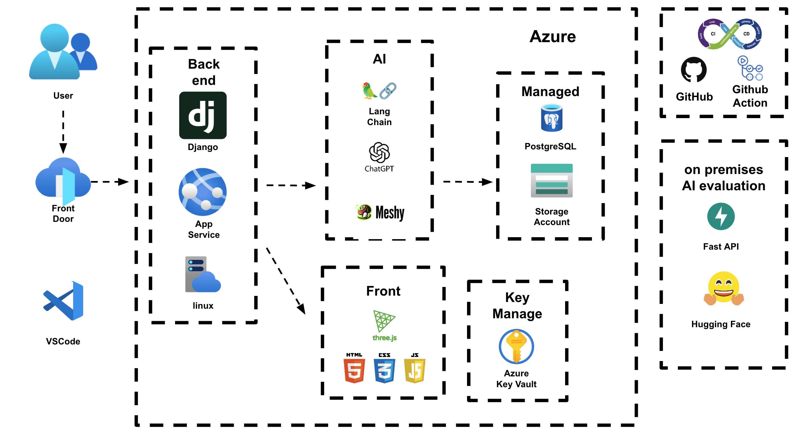

# Miravelle
Miravelle → Miracle(기적) + Belle(아름다움)

## 프로젝트 개요

### 1. 프로젝트 이름
Meshy AI 기반 3D 생성 플랫폼

### 2. 목적
본 프로젝트는 Meshy AI의 API를 활용하여 3D 오브젝트를 자동 생성하고, Django 기반의 웹 애플리케이션을 통해 이를 관리 및 제공하는 플랫폼을 개발하는 것을 목표로 한다.

### 3. 주요 기능
- 사용자 로그인 및 인증 (JWT 활용)
- Meshy AI API를 통한 3D 모델 생성
- 생성된 3D 모델 저장 및 관리
- 생성된 3D 모델의 미리보기 및 다운로드 기능

## 기술 스택
| 구성 요소        | 기술 |
|----------------|------|
| 백엔드         | Django, Django REST Framework |
| 데이터베이스   | PostgreSQL |
| 프론트엔드     | HTML, CSS, JavaScript |
| 3D 뷰어       | Three.js |
| AI      | Meshy AI API, Chat GPT, LangChain |
| 배포 및 운영   | Azure (App Service) |

## 시스템 아키텍처
```
사용자 → Django API → Meshy AI API → 3D 모델 생성 → 저장 및 제공
```


## 규칙
[코드 규칙](Docs/docs/code_convention.md)       
[커밋 규칙](Docs/docs/commit_rule.md)     

## 데이터 흐름
1. 사용자가 Django 웹 애플리케이션에 로그인
2. 3D 모델 생성 요청을 API로 전송
3. Django 백엔드에서 Meshy AI API 호출
4. Meshy AI에서 3D 모델을 생성 후 반환
5. 생성된 3D 모델을 데이터베이스에 저장하고 파일 서버에 업로드
6. 사용자는 3D 뷰어를 통해 모델 확인 후 다운로드 가능

## 설치 및 실행 방법
```bash
git clone https://github.com/your-repo/meshy-ai-3d-platform.git
cd meshy-ai-3d-platform
pip install -r requirements.txt
python manage.py migrate
python manage.py runserver
```

## 연관 프로젝트
### **Miravelle-FastAPI**    
- 해당 프로젝트는 Miravelle의 온프레미스 환경 프로젝트입니다.       
[GitHub Repository](https://github.com/eungyukm/Miravelle-FastAPI)     

### **ThreeNest**    
- 해당 프로젝트는 Three.js를 R&D한 프로젝트입니다.        
[GitHub Repository](https://github.com/eungyukm/ThreeNest)    

### **VisualNIMA**
- 해당 프로젝트는 NIMA를 파인튜닝하는 프로젝트입니다.        
[GitHub Repository](https://github.com/eungyukm/VisualNIMA.git)

### **image-quality-nima DataSet**
- 해당 데이터셋은 NIMA로 평가된 3000여장의 데이터 셋입니다.          
[Hugging Face](https://huggingface.co/datasets/eungyukm/image-quality-nima)

### **image-manual-label DataSet**
- 해당 데이터셋은 직접 1~10점까지 이미지를 평가한 데이터 입니다.        
[Hugging Face](https://huggingface.co/datasets/eungyukm/image-manual-label)

## **mesy-texutred-dataset-v2**
- 해당 데이터셋은 texture-classifier를 통해서 텍스쳐링이 된것과 안된것을 구분한 데이터셋 입니다.          
[Hugging Face](https://huggingface.co/datasets/suhyon/meshy-textured-dataset-v2) 

### **nima_finetuned Model**
- 해당 모델은 NIMA 모델을 파인튜닝한 모델입니다.      
[Hugging Face](https://huggingface.co/eungyukm/nima_finetuned)

### **texture-classifier**
- 해당 모델은 텍스쳐링된 모델과 텍스쳐링 되지 않은 모델 분류 모델입니다.        
[Hugging Face](https://huggingface.co/suhyon/texture-classifier)

## 기여 방법
기여를 원하시면 이슈를 생성하고 PR을 제출해 주세요. 

## 라이선스
MIT 라이선스
